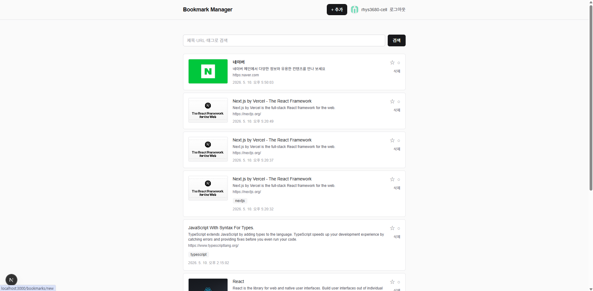

# Bookmark Manager

> 개발자용 북마크 매니저 — 기술 블로그·문서·영상 링크를 태그로 정리하고 검색.
> React/Next.js 학습 + 포트폴리오 목적의 토이 프로젝트.

**Live**: https://toy-project-1-omega.vercel.app

## 스크린샷



## 주요 기능 (v1 MVP 완료)

- **GitHub OAuth 로그인** — Better Auth + DB 세션
- **북마크 추가** — URL 붙여넣기 → OG 메타데이터 자동 추출(제목/설명/썸네일)
- **목록** — 최신순 카드 뷰, 썸네일 + 제목 + 2줄 설명 + 태그 칩
- **태그** — 쉼표 구분 입력, 사용자별 태그 풀
- **검색** — 제목/URL/태그 LIKE 매치 (M:N 검색은 EXISTS 서브쿼리)
- **삭제** — 확인 다이얼로그 + IDOR 방어 (자기 북마크만)
- **SSRF 방어** — 외부 fetch 시 사설 IP / 클라우드 메타데이터 / `javascript:`·`file:` 프로토콜 차단
- **3층 방어** — proxy(쿠키) + page(세션 검증) + Server Action(세션 + user 스코프)
- **회귀 테스트** — vitest로 NULL UNIQUE / IDOR / SSRF / CASCADE 박제

## 기술 스택

| 영역 | 선택 |
|---|---|
| 프레임워크 | Next.js 16 (App Router, Server Components, Server Actions) |
| 언어 | TypeScript 5 |
| UI | React 19, Tailwind CSS v4 |
| ORM | Drizzle ORM 0.45 |
| DB | SQLite via `@libsql/client` (로컬 파일 / Turso 배포) |
| 인증 | Better Auth v1.6 + GitHub OAuth (DB 세션) |
| HTML 파싱 | node-html-parser |
| 테스트 | vitest (단위 + DB 통합) |
| 배포 | Vercel + Turso |

## 빠른 시작

```bash
# 1. 의존성 설치
pnpm install

# 2. 환경 변수
cp .env.example .env.local
# 필요 시 DATABASE_URL 수정

# 3. DB 마이그레이션
pnpm db:migrate

# 4. 개발 서버
pnpm dev
# http://localhost:3000
```

### 테스트

```bash
pnpm test         # watch
pnpm test:run     # 1회 실행
pnpm test:ui      # vitest UI
```

### 환경 변수

| 변수 | 설명 |
|---|---|
| `DATABASE_URL` | libsql 연결 문자열. 로컬: `file:./local.db`, Turso: `libsql://...` |
| `DATABASE_AUTH_TOKEN` | (배포) Turso 인증 토큰 |
| `BETTER_AUTH_SECRET` | 쿠키 서명/암호화 키. `npx @better-auth/cli@latest secret`으로 생성. dev/prod 분리 필수 |
| `BETTER_AUTH_URL` | 서버 측 baseURL. 콜백 URL 생성에 사용 |
| `NEXT_PUBLIC_BETTER_AUTH_URL` | 클라이언트 측 baseURL. 누락 시 prod에서 CORS 차단 |
| `GITHUB_CLIENT_ID` / `GITHUB_CLIENT_SECRET` | GitHub OAuth App. dev/prod 별도 등록 |

`.env.local`은 gitignore. 커밋 금지.

## 프로젝트 구조

```
app/
  page.tsx                  목록(홈) — 인증 가드 + 검색
  login/page.tsx            GitHub 로그인 (Client)
  sign-out-button.tsx       로그아웃 (Client)
  bookmarks/
    new/                    추가 폼 + Server Action
    actions.ts              삭제 Server Action
    delete-button.tsx       Client Component (window.confirm)
  api/auth/[...all]/        Better Auth handler
lib/
  auth.ts                   Better Auth 서버 인스턴스
  auth-client.ts            Better Auth 클라이언트
  db/
    client.ts               libsql + Drizzle 초기화
    schema.ts               비즈니스 테이블 + auth 테이블 re-export
    auth-schema.ts          Better Auth 표준 4 테이블
    queries.ts              조회 함수 레이어
  url-guard.ts              SSRF 방어 (사설 IP / 메타데이터 차단)
  og.ts                     OG 메타 fetch + 파싱
  tags.ts                   parseTagInput
proxy.ts                    1차 가드 (Next.js 16의 middleware.ts)
tests/                      vitest — 단위 + DB 통합
drizzle/                    마이그레이션 SQL
```

## 보안 정책 (v1)

- **3층 방어**: proxy(쿠키) → page(세션 검증) → Server Action(세션 + user 스코프)
- 모든 폼 입력은 서버에서 재검증 (HTML5 우회 가능)
- 저장될 URL은 http/https 화이트리스트 (XSS 방어 — `<a href>` 렌더 대상)
- 외부 fetch 전 SSRF 가드: 사설 IP / 클라우드 메타데이터 차단, 5초 타임아웃, 256KB 응답 제한
- IDOR 방어: 모든 SELECT/UPDATE/DELETE에 `user_id = session.user.id`
- `import "server-only"` 가드: DB 클라이언트, auth 인스턴스, SSRF 가드 등
- 회귀 테스트: NULL UNIQUE / IDOR / SSRF / CASCADE를 vitest로 박제

## 라이선스

학습용 토이 프로젝트. 별도 라이선스 명시 없음.